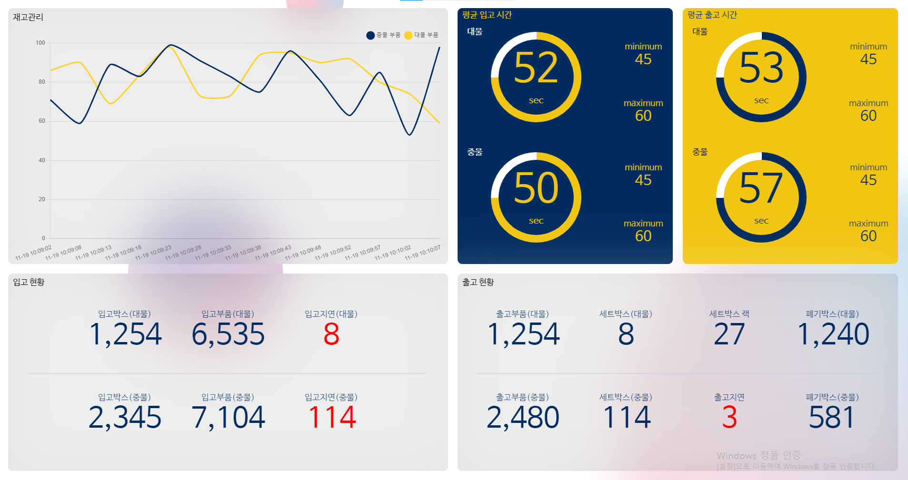
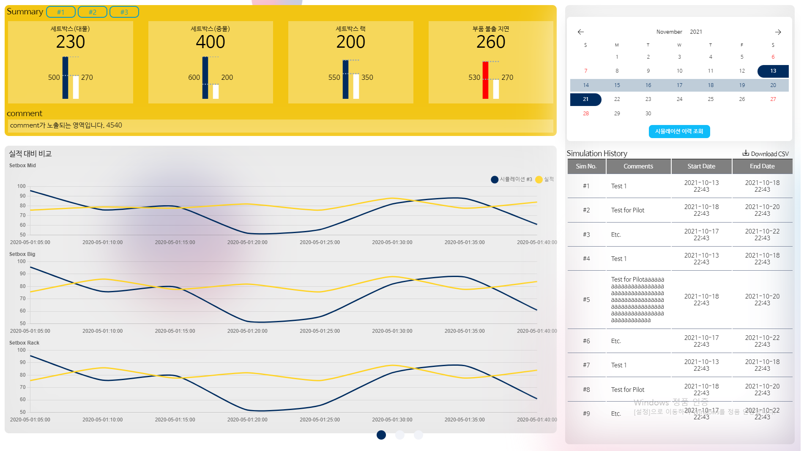

# sim-dashboard

# 시뮬레이션 결과 대시보드

## 실행 방법

```bash
git clone https://github.com/AYOKINYA/sim-dashboard.git
cd sim-dashboard
docker-compose up -d
```

컨테이너 실행 후, http://localhost:9999 접속해 프론트 화면 확인.

서버는 4000 port에서 확인


## 구현 내용

### 프론트

: Adobe XD에서 변환된 html & css를 가지고 시작해 수정하면서 구현함

## 1. Main Page
http://localhost:9999/



- 재고 관리 Line Chart:  현재 시뮬레이션의 재고율 받아 화면 생성
- 평균 입출고 시간 Doughnut Chart : 현재 시뮬레이션의 평균 입출고 시간 받아 화면 생성
- 입출고 현황 Grid : 현재 시뮬레이션의 입고 현황 받아 화면 생성

## 2. Simulation Page
http://localhost:9999/simulation



- 달력 : 사용자로부터 날짜 범위를 입력 받아 해당 범위에 해당하는 시뮬레이션 이력 요청
- History Table :
    1. 달력에서 요청한 시뮬레이션 이력을 서버로부터 받아 화면 생성.
    2. 사용자로부터 클릭 입력을 받아 클릭된 시뮬레이션 정보 서버에 요청 
- 실적 대비 비교 Line Chart : 사용자가 테이블에서 클릭하거나 버튼을 클릭하면 해당 시뮬레이션 자료를 받아 화면 생성
- 요약 Bar Chart : 사용자가 테이블에서 클릭하거나 버튼을 클릭하면 해당  시뮬레이션 요약 자료를 받아 화면 생성

### 백엔드

화면에 필요한 데이터를 반환해주는 MOCK API 서버

## 사용 기술

  프론트 )

          React.js : 프론트 구현 기본 Library

          Chart.js : Doughnut Chart, BarChart, Line Chart 등 구현

          react-modern-calendar-datepicker : 달력 컴포넌트 생성

          react-table : 시뮬레이션 이력 조회 테이블을 생성

  백엔드 )

          node.js express : Mock API를 가장 쉽게 만들 수 있는 프레임워크

          winston : logger Library

          Docker : Docker-compose와 Dockerfile을 사용해 프론트과 서버 앱 동시에 실행

## 개발 과정

인원 : 2명

기간 : 3주

@AYOKINYA 구현 부분 :

프론트 )

1. 평균 입출고 Doughnut Chart : 도넛 차트안에 글씨를 써넣는 것은 chartjs-plugin-doughnutlabel을 사용하려고 했다. 그러나 chart.js 3.x에서는 지원이 되지 않아 chartjs-plugin-doughnutlabel 레포에서 반려된 chart.js 3.x & typescript 버전 PR 내용을 보고 직접 chart.js 3.x & javascript 버전으로 바꿔서 사용했다.
참고 주소 : https://github.com/ciprianciurea/chartjs-plugin-doughnutlabel/pull/18
2. Calendar
3. History Table
4. Summary Bar Chart

백엔드 )

1. express 서버 구조와 설정 (router, logger, CORS 등)
2. 구현한 프론트 컴포넌트에 대응되는 API 생성
3. Dockerizing

## 추후 개선 사항

- 현재 express 서버는 MOCK API를 만들기 위한 서버.
지금처럼 단순히 JSON 객체에 값을 넣어준 것을  반환하지 않고 DB와 연동해서 데이터 가져와서 반환해보기
